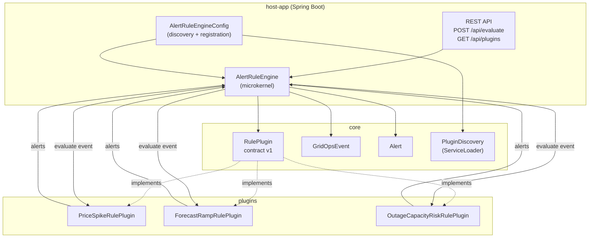

# GridOps Alert Rule Engine — Microkernel (Plugin) Architecture

This project is an **educational** implementation of the **Microkernel** (Plugin) architecture (Richards & Ford, *Software Architecture: The Hard Parts*) applied to an **energy planning** domain: a core Alert Rule Engine evaluates normalized GridOps events and delegates rule logic to pluggable strategy plugins.

---

## What Is the Microkernel Architecture?

The **microkernel** (or **plugin**) architecture has two main parts:

1. **Core (microkernel)** — A minimal runtime that provides:
   - **Lifecycle**: loading, registering, and orchestrating plugins
   - **Contracts**: a stable API/SPI that plugins implement
   - **Shared types**: e.g. normalized events and alerts
   - **Execution**: invoking plugins and aggregating results

2. **Plugins** — Encapsulated units of behavior that:
   - Implement the published contract (e.g. `RulePlugin` v1)
   - Contain domain-specific logic (e.g. price spike, forecast ramp, outage risk)
   - Do not depend on each other; they depend only on the core contract

The core stays **thin**: it knows nothing about “price” or “reserve margin.” It only knows “event in, run all plugins, collect alerts.” That keeps the system **extensible** without changing the kernel.

---

## Why Plugins?

- **Extensibility**: New rules (e.g. “renewable curtailment”) are added as new plugins and JARs, without modifying the core.
- **Separation of concerns**: Each plugin owns one strategy; the core owns discovery, lifecycle, and orchestration.
- **Contract stability**: A versioned contract (e.g. `RulePlugin` v1) lets the core evolve slowly while plugins evolve or multiply.
- **Deployment flexibility**: With **ServiceLoader**, adding a plugin can be “drop a JAR on the classpath”; with an **explicit registry**, the host app (or config) decides exactly which plugins run.

---

## How Contracts Avoid Core Bloat

- The core defines **only**:
  - **Event**: `GridOpsEvent` (id, type, timestamp, payload map) — domain-agnostic.
  - **Alert**: `Alert` (pluginId, ruleId, severity, message, time) — generic.
  - **Contract**: `RulePlugin` — `id()`, `name()`, `contractVersion()`, `evaluate(GridOpsEvent)`.

- Plugins **interpret** the payload (e.g. `price`, `rampMw`, `reserveMarginPct`). The core never parses or validates domain fields; it just passes the event and aggregates alerts. So the core stays small and stable while the domain grows in plugins.

---

## Strengths and Weaknesses

| Strengths | Weaknesses |
|-----------|------------|
| **Extensibility**: New rules without changing core | **Versioning**: Contract changes (v2) require plugin upgrades or compatibility layers |
| **Clear boundaries**: Core vs plugin responsibilities | **Testing**: Plugins must be tested in isolation and against contract tests |
| **Deployment options**: ServiceLoader (classpath) or explicit registry | **Discovery**: ServiceLoader is classpath-based; no built-in dynamic load/unload |
| **Single process**: No network hop; simple deployment | **Scaling**: Horizontal scaling is of the whole app, not individual rules |

---

## Microkernel vs Microservices

| Aspect | Microkernel (this example) | Microservices |
|--------|----------------------------|---------------|
| **Deployment** | One process; plugins in same JVM or classpath | Many processes; services over network |
| **Coupling** | Shared contract (interface + types); compile-time dependency on core | APIs and events; versioned endpoints and schemas |
| **Failure** | Plugin exception can be isolated in-engine (e.g. one plugin fails, others still run) | Service down → timeouts, retries, circuit breakers |
| **Extensibility** | Add plugin JAR + META-INF/services or register bean | Add new service and wire it into the mesh |
| **When to use** | Extensible product, single team or few teams, one deployable | Independent teams, independent scaling, polyglot, strong isolation |

Here, the Alert Rule Engine is a **single deployable** with a **microkernel** inside it; each “rule type” is a plugin, not a separate service.

---

## Component Diagram (Mermaid)



---

## Plugin Discovery: ServiceLoader vs Explicit Registry

| | ServiceLoader | Explicit registry |
|--|----------------|--------------------|
| **How** | `META-INF/services/com.gridops.microkernel.core.contract.RulePlugin` lists implementation class names; `ServiceLoader.load(RulePlugin.class)` discovers them on classpath. | Host app (or config) constructs or injects `RulePlugin` instances and calls `engine.registerPlugin(plugin)`. |
| **Pros** | Zero in-code config; add JAR + services file for “drop-in” plugins. | Full control over which plugins run; easy to test with mocks; can support dynamic load/unload. |
| **Cons** | Classpath-bound; harder to test “no plugins” or “only plugin A”; no built-in version gating in discovery. | Every plugin must be wired (e.g. Spring beans or factory); not “drop a JAR and go.” |

This project uses **ServiceLoader** in the host-app for discovery; the same engine can be wired with an explicit list of plugins (e.g. from Spring or a config file) if you prefer.

---

## Running the Application

- Build: `mvn clean install -DskipTests` then `mvn -pl host-app spring-boot:run`, or run tests: `mvn test`.
- **POST /api/evaluate** — Body: `{ "eventId": "...", "eventType": "...", "payload": { ... } }`. Returns `eventId`, `alerts[]`, `pluginsFired[]`.
- **GET /api/plugins** — Returns the list of installed plugins (id, name, contractVersion).

Example:

```bash
curl -s -X POST http://localhost:8080/api/evaluate \
  -H "Content-Type: application/json" \
  -d '{"eventType":"price","payload":{"price":200}}'
```

You should see alerts from the `price-spike` plugin and `pluginsFired` including `"price-spike"`.
