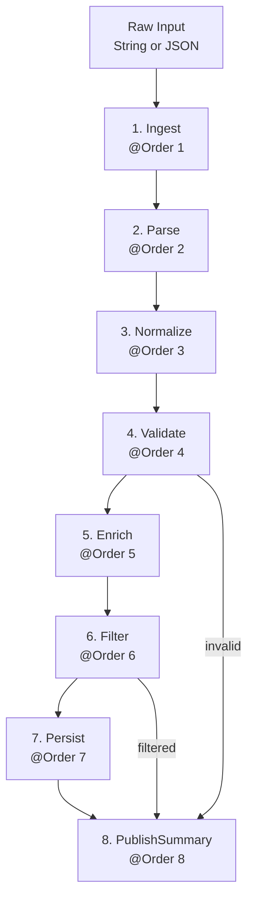

# Architecture — GridOps Telemetry Pipeline

## Pattern: Pipeline (Pipes & Filters)

The **Pipes & Filters** pattern decomposes a processing workflow into a sequence of independent, single-responsibility stages (_filters_) connected by data channels (_pipes_).  Each stage receives an input, transforms it, and passes the result to the next stage.

### Why Pipes & Filters for telemetry?

Grid telemetry events arrive from heterogeneous sources (sensors, SCADA systems, market APIs) in different formats with varying quality.  A linear processing chain lets each concern live in isolation: parsing, normalization, validation, enrichment, and persistence are independently testable and replaceable without affecting other stages.

---

## Pipeline stages

```
Ingest(1) → Parse(2) → Normalize(3) → Validate(4) →
Enrich(5) → Filter(6) → Persist(7) → PublishSummary(8)
```

| # | Stage | Responsibility |
|---|-------|----------------|
| 1 | **Ingest** | Entry gate: null guard, whitespace strip |
| 2 | **Parse** | Format detection (JSON / pipe-delimited), field extraction |
| 3 | **Normalize** | Canonicalize region names, round values, assign default units |
| 4 | **Validate** | Business-rule enforcement (required fields, ranges, timestamp) |
| 5 | **Enrich** | Attach grid-zone, severity labels, pipeline metadata |
| 6 | **Filter** | Silently drop heartbeats and unrecognised events |
| 7 | **Persist** | Save to RDBMS via Spring Data JPA |
| 8 | **PublishSummary** | Emit processing outcome as a Spring `ApplicationEvent` |

---

## Data flow diagram



---

## Context object

The `TelemetryPipelineContext` is the **pipe** — a single mutable value object that travels through every stage.

```
TelemetryPipelineContext
├── rawInput          : String        (set by Ingest)
├── eventType         : enum          (set by Parse)
├── deviceId          : String        (set by Parse, upper-cased by Normalize)
├── region            : String        (set by Parse, canonicalized by Normalize)
├── timestamp         : Instant       (set by Parse)
├── value             : double        (set by Parse, rounded by Normalize)
├── unit              : String        (set by Parse or defaulted by Normalize)
├── metadata          : Map<String,Object>  (populated by Enrich)
├── valid             : boolean       (flipped to false by Validate / Ingest)
├── validationErrors  : List<String>  (accumulated by any stage)
├── filtered          : boolean       (set by Filter)
├── filterReason      : String        (set by Filter)
└── persistedId       : Long          (set by Persist)
```

---

## Pipeline runner

`TelemetryPipeline` is the **assembler** that wires stages together:

1. Spring injects `List<PipelineStage>` sorted by `@Order`.
2. The runner iterates the first N-1 stages; if the context becomes invalid or filtered, remaining main stages are skipped.
3. The final `PublishSummary` stage **always** runs — it is the observability guarantee.

---

## Stage ordering with `@Order`

Spring's `@Order` annotation on each `@Component` stage drives the injection order of `List<PipelineStage>`:

```java
@Component @Order(1) public class IngestStage        implements PipelineStage { … }
@Component @Order(2) public class ParseStage         implements PipelineStage { … }
// …
@Component @Order(8) public class PublishSummaryStage implements PipelineStage { … }
```

This makes the stage sequence self-documenting: reading any stage class immediately tells you where it sits in the pipeline.

---

## Trade-offs

| Pro | Con |
|-----|-----|
| Each stage is independently testable (unit tests with no Spring) | Single-context coupling: stages share one mutable object |
| Adding a stage requires only a new `@Component @Order(n)` class | Ordering gaps must be managed manually when inserting stages |
| PublishSummary decouples pipeline from consumers (event-driven) | Synchronous execution — not suitable for very high throughput without async wrappers |
| Swap persistence (H2 → Postgres) or publisher (event → Kafka) transparently | Long chains can make debugging harder without good logging |

---

## Extension points

| Scenario | What to change |
|----------|---------------|
| Add a new stage (e.g., DeduplicateStage) | Create `@Component @Order(n)` class; renumber or gap existing orders |
| Replace H2 with Postgres | Update `application.yml` datasource; add Postgres driver dependency |
| Publish to Kafka instead of ApplicationEvent | Replace `ApplicationEventPublisher` in `PublishSummaryStage` with a `KafkaTemplate` |
| Add async processing | Wrap `TelemetryPipeline.process()` with `@Async` and return `CompletableFuture` |
| Schema migration | Add Flyway or Liquibase; change `ddl-auto` to `validate` |
