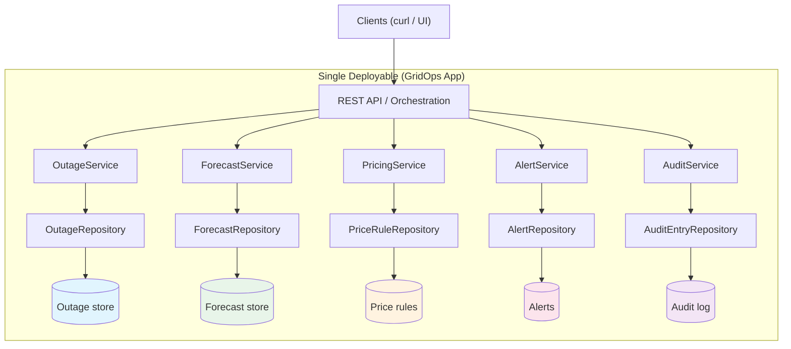

# Service-Based Architecture: GridOps Example

This document describes the **Service-Based Architecture** pattern (as popularized by Mark Richards and Neal Ford) and how this GridOps example implements it in a single deployable with clear internal service boundaries.

---

## What Is Service-Based Architecture?

**Service-Based Architecture** sits between a **monolith** and **microservices**. You deploy a **single application** (one process, one deployable), but you structure the codebase into **coarse-grained services** with clear boundaries. Each service:

- Has a **bounded context** and **owned data** (or in-memory store in this example).
- Exposes an **internal interface** used only within the same process.
- Communicates with other services **in-process** (method calls, dependency injection), not over the network.

### Why It’s Common in Enterprises

1. **Simpler than microservices** — One deployable, one database (or shared DB with logical schema per service), no distributed tracing or service mesh required for day one.
2. **Clearer than a big monolith** — Boundaries are explicit (package per service, interface per service), which improves maintainability and team ownership.
3. **Easier operations** — Single deployment pipeline, single runtime to monitor, no network partitions between “services” inside the app.
4. **Good stepping stone** — If you later need independent scalability or team autonomy, the boundaries are already in place to extract a service into its own deployable (evolution to microservices).

---

## Tradeoffs vs Microservices

| Aspect | Service-Based (this example) | Microservices |
|--------|------------------------------|---------------|
| **Deployability** | Single deployable; release is all-or-nothing. | Each service can be deployed independently. |
| **Simplicity** | No RPC/HTTP between services; no distributed transactions; simpler debugging. | Network calls, eventual consistency, distributed tracing, service discovery. |
| **Scalability** | Scale the whole app (vertical or multiple instances of the same app). | Scale individual services (e.g. only PricingService). |
| **Team ownership** | Logical ownership by package; multiple teams can work in same repo with clear boundaries. | Physical ownership by repo/deployable; strong Conway alignment. |
| **Technology** | Single tech stack per deployable. | Can mix stacks per service. |
| **Failure isolation** | Process crash affects everything. | One service can fail without bringing down others (if designed for it). |

**When to choose Service-Based:** You want **bounded contexts and clear boundaries** without the operational and design complexity of distributed microservices. When to choose **microservices:** You need independent deployability, scaling, or polyglot per service and are willing to accept the added complexity.

---

## Keeping Boundaries Strong (Avoiding a Big Ball of Mud)

To keep the architecture from decaying into a monolith with no real boundaries:

1. **Package per service**  
   Each service lives in its own package (e.g. `com.gridops.outage`, `com.gridops.forecast`). No other package should depend on another service’s *implementation*; depend only on the service *interface*.

2. **Internal interfaces**  
   Each service exposes an interface (e.g. `OutageService`) and one implementation (e.g. `OutageServiceImpl`). Controllers or orchestrators depend on the interface and receive the implementation via DI. This keeps the contract stable and makes testing easy (mock the interface).

3. **Data layer and data ownership**  
   Each service has a **repository interface** (e.g. `OutageRepository`) in its package. The service implementation depends on this interface; a concrete implementation (e.g. `InMemoryOutageRepository`) holds the actual storage. No service reads or writes another service’s repository or storage. Data is exchanged only via the service’s API. When evolving to microservices, you can replace the in-memory repository with one that talks to a dedicated DB or schema.

4. **No shared “domain” soup**  
   Avoid one big shared domain model. Each service defines its own records/DTOs (e.g. `OutageRecord`, `ForecastRecord`). The API layer (or a thin orchestration layer) translates between them if needed.

5. **Orchestration in one place**  
   Cross-service workflows (e.g. “report outage → raise alert → audit”) live in a dedicated orchestration layer or controller that calls multiple services. Services do not call each other in a chain; the orchestrator does.

---

## Internal Services and Data Ownership (Mermaid)

- **REST API / Orchestration:** Entry point; calls one or more services in-process.
- **Services:** Coarse-grained; each has an interface and implementation and depends on its **repository** (data layer).
- **Repositories:** Each service has a repository interface and an implementation (e.g. `InMemoryOutageRepository`) that owns the storage. No cross-service data access.
- **Data:** Storage is behind the repository; can be in-memory (demo) or a dedicated DB/schema when evolving to microservices.

---

## How to Evolve to Microservices

If you later need independent deployability or scaling, you can extract services one at a time:

1. **Choose a service** (e.g. `AuditService`) and give it its own codebase (or module) and deployable (e.g. Spring Boot app).
2. **Replace in-process calls with HTTP (or messaging).**  
   - Option A: REST — orchestrator and other services call `AuditService` via HTTP.  
   - Option B: Events — `AuditService` subscribes to “AuditRequested” events and records them; no direct call from other services.
3. **Move that service’s data** to a database (or schema) owned by the new deployable. Ensure only that service accesses it.
4. **Keep the same logical interface** (e.g. “record(actor, action, targetType, targetId, details)”) so callers’ *usage* stays the same; only the transport (method call → HTTP/event) changes.
5. **Repeat** for other services (Outage, Forecast, Pricing, Alert), prioritizing by team boundaries or scaling needs.

The existing **package-per-service** and **interface-based** design in this repo makes that extraction straightforward: you literally move the package (or copy it) into a new project and expose the same operations over the network.

---

## Summary

- **Service-Based** = single deployable, coarse-grained internal services, in-process communication, clear boundaries and data ownership.
- **Tradeoff:** Simplicity and single deployment vs independent deployability and per-service scaling of microservices.
- **Strong boundaries:** Package per service, internal interfaces, data ownership, no shared domain soup, orchestration in one place.
- **Evolution:** Extract one service at a time into its own deployable and replace in-process calls with HTTP or events.

This GridOps example demonstrates all of the above with five services (Outage, Forecast, Pricing, Alert, Audit) and a REST API that orchestrates them in-process.
