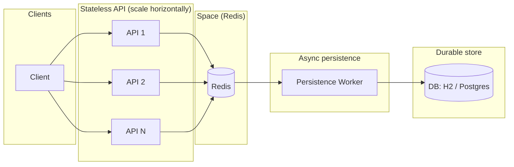

# Space-Based Architecture: Energy Operations Example

This project implements a **Space-Based Architecture** (Richards & Ford) for an energy operations scenario: handling sudden **congestion/price spike storms** with many incoming price updates, alert evaluation, and caching. Redis acts as the shared **"space"**; API nodes are stateless and scale horizontally; a background worker persists alert history to a database.

---

## What the "Space" Means

In Space-Based Architecture, the **space** is a shared, in-memory data grid that holds the **hot, mutable state** of the system. Instead of each processing unit (e.g. API node) holding its own state or hitting a central database for every read/write, all units read and write through the space.

- **In this example:** Redis is the space. It holds:
  - **Latest price per node** — fast lookup by `nodeId`
  - **Rolling time window of prices per node** — for spike detection (e.g. current price vs. recent average)
  - **Active alerts with TTL** — reservation pattern: alerts auto-expire when their TTL elapses (condition cleared or no refresh)
  - **Queue of alert records** — for async persistence to the DB

The **processing units** are the stateless API nodes: they receive requests, interact with the space (Redis), and return responses. They do not store session or domain state locally.

---

## Partitioning Concepts and Why It Scales

- **Partitioning by key:** Data in the space is partitioned by logical keys (e.g. `energy:price:{nodeId}`, `energy:window:{nodeId}`). Different nodes (grid nodes in the energy domain) map to different keys, so load is spread across Redis keys and, in a clustered setup, across shards.
- **No single bottleneck:** Reads/writes are key-based; there is no single "master" row or table that every request must touch. Under a price spike storm, many nodes can be updated in parallel.
- **Horizontal scaling:** You add more **API instances** behind a load balancer. Each instance is stateless and talks to the same Redis. Redis itself can be scaled (e.g. Redis Cluster, or a managed Redis) by partitioning keys across shards.
- **Elasticity:** Under load, you scale out API nodes; the space (Redis) absorbs the read/write load and can be scaled independently (bigger instance or cluster).

---

## High-Level Flow (Mermaid)

- **Clients** send bulk price updates and query active alerts.
- **API nodes** are stateless; they read/write only to **Redis (the space)**.
- **Redis** holds hot state (prices, windows, active alerts with TTL) and an alert-history queue.
- **Persistence worker** runs inside the same (or a dedicated) app instance, drains the queue, and writes **alert history** to the **DB**.

---

## Strengths and Weaknesses

### Strengths

| Aspect | Benefit |
|--------|--------|
| **Throughput** | Hot path is in-memory (Redis). No DB on the critical path for price writes or alert evaluation. |
| **Elasticity** | Add/remove API instances without moving state; scale the space (Redis) separately. |
| **Simplicity of API nodes** | Stateless services are easy to deploy, restart, and load-balance. |
| **Resilience to spike storms** | Bulk price updates and alert evaluation are handled in the space; DB is only used asynchronously for history. |

### Weaknesses

| Aspect | Trade-off |
|--------|-----------|
| **Complexity** | Two tiers of state (space + DB), eventual consistency for persisted alerts, and operational complexity (Redis + app + DB). |
| **Consistency** | Active alerts are eventually consistent with the space; persisted history is async and may lag. |
| **Space as single point of failure** | If Redis is down, the API cannot serve correctly; Redis needs HA (e.g. Sentinel/Cluster) for production. |
| **Not for huge relational datasets** | The pattern is best when hot working set fits in the space; large relational reporting is better served by the DB and offline pipelines. |

---

## Reservation / TTL Pattern for Alerts

- When a **spike condition** is met (e.g. current price > threshold × rolling average), the system creates an **active alert** in the space and gives it a **TTL** (e.g. 300 seconds).
- The alert key in Redis **expires** after the TTL unless refreshed. So:
  - If the condition **clears** (prices normalize), the alert is not refreshed and **disappears** when the TTL elapses.
  - If the condition **persists**, a future price update could create a new alert (or we could extend the design to refresh TTL on the same alert).
- This avoids explicit "clear alert" logic and keeps the space free of stale alerts.

---

## Implementation Summary

| Endpoint / Component | Role |
|----------------------|------|
| `POST /price-updates` | Bulk ingest; writes latest price + rolling window per node into Redis; evaluates spike and creates alerts with TTL; enqueues for persistence. |
| `GET /active-alerts` | Reads all active alert keys from the space (expired ones are gone). |
| **Persistence worker** | Periodically pops from the alert-history queue in Redis and batch-inserts into the DB (H2 or Postgres). |

---

## Running the System

1. **Start the space (and optional DB):**  
   `docker compose up -d`
2. **Run the app (H2):**  
   `./mvnw spring-boot:run`  
   Or with Postgres:  
   `SPRING_PROFILES_ACTIVE=postgres POSTGRES_HOST=localhost ./mvnw spring-boot:run`
3. **Load test:**  
   See [LOAD_TESTING.md](./LOAD_TESTING.md) for simple script guidance (e.g. bulk `POST /price-updates`, `GET /active-alerts`).

---

## References

- Richards, M., & Ford, N. (2015). *Software Architecture Patterns*. O’Reilly. (Space-Based Architecture chapter.)
- This repo: `docs/ARCHITECTURE.md`, `docs/LOAD_TESTING.md`, and the `space-based` Maven project.
